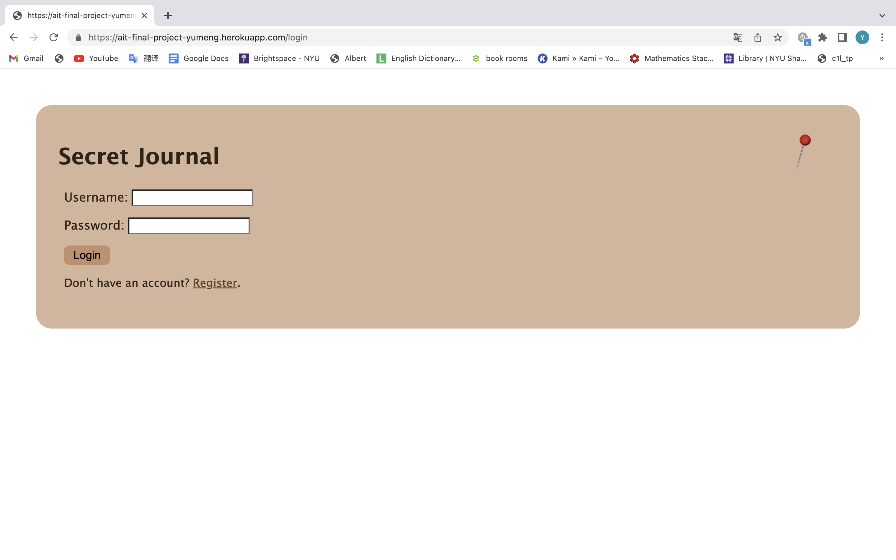
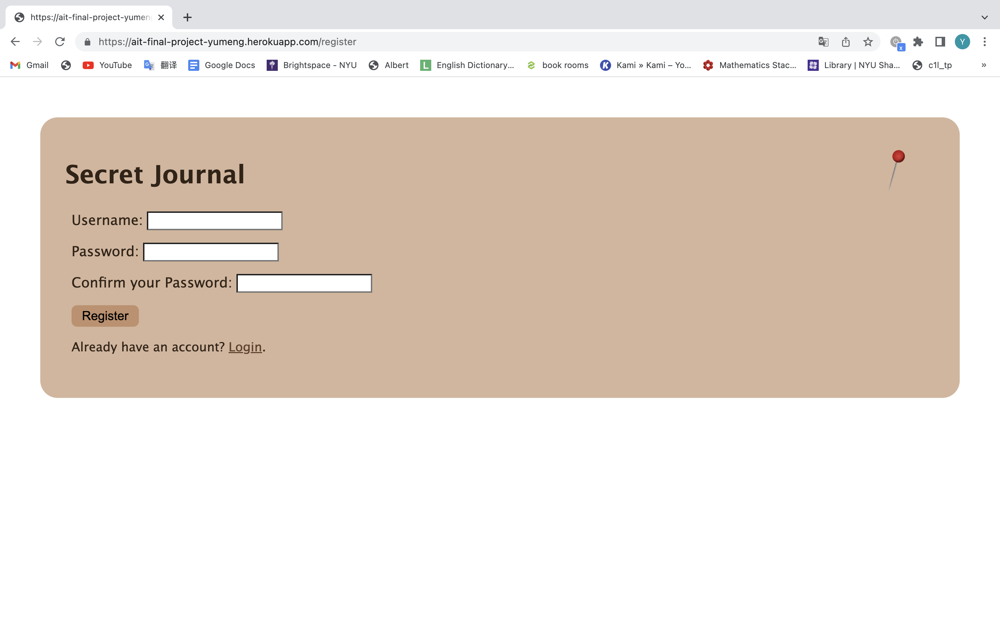
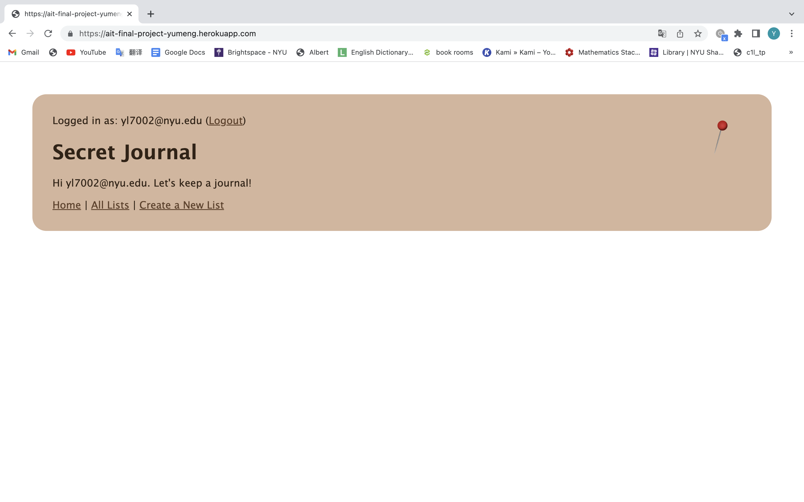
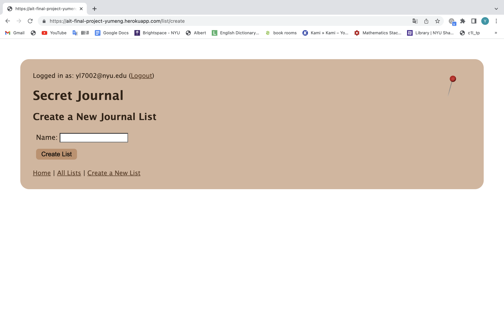
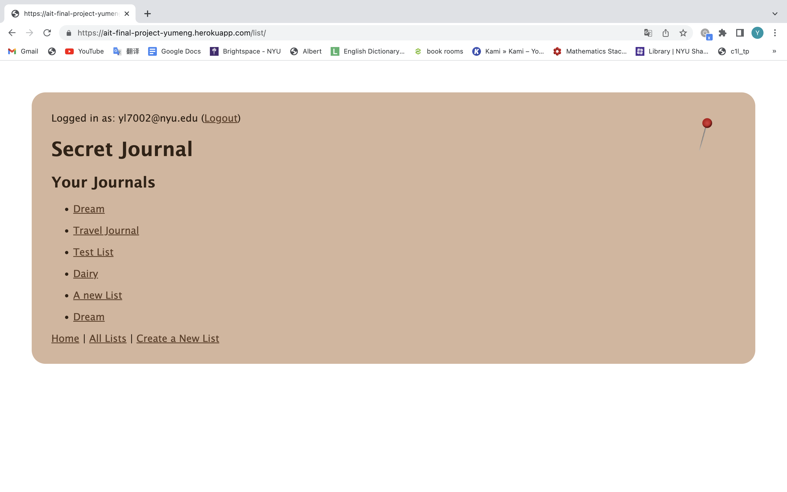
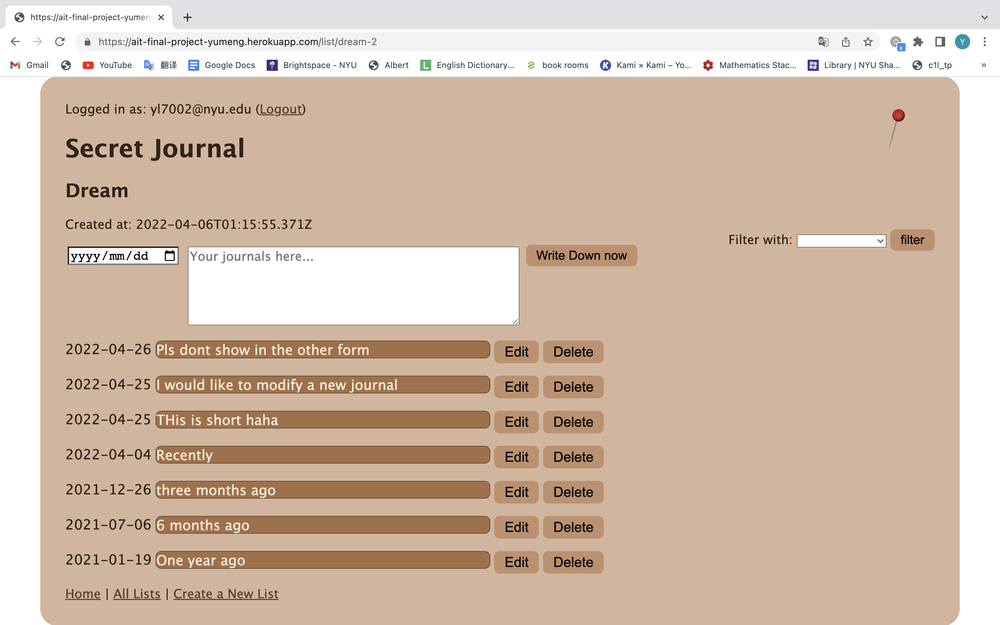
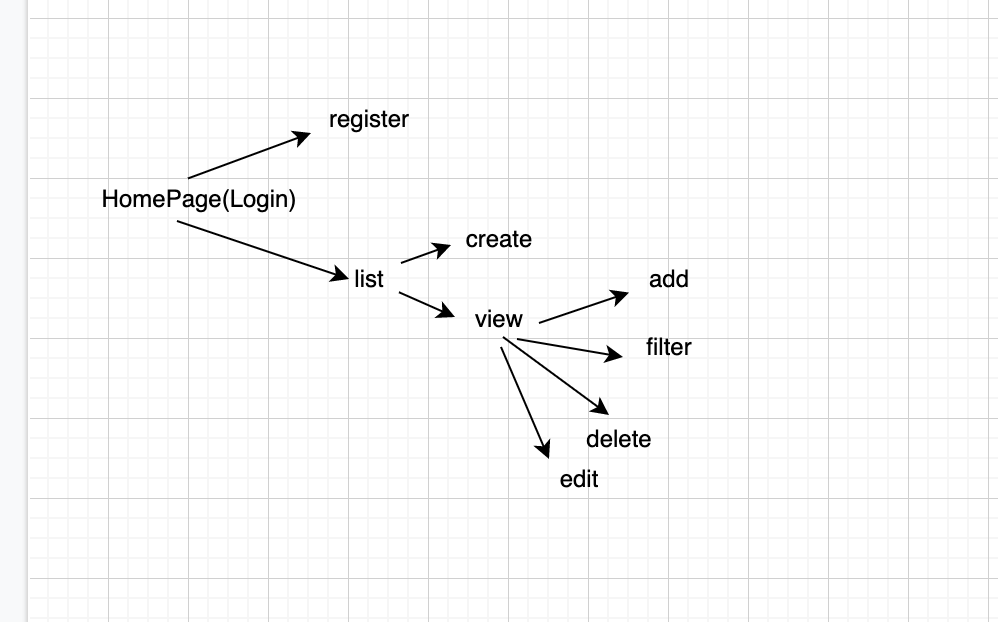

# Secret Journal 

## Overview

Remembering the exact date and details of a memorial event is really difficult. Also, numerous interesting ideas just flash by without writing them down. Sooo... that's where Secret Journal comes in!

Secret Journal is a web app that will allow users to keep their own journals. Users can register and login. Once they're logged in, they can create or view their journal lists. For every journal list that they have, they can add journals to the list or delete one. Also they can filter to see the journals in the past 6 months, past three months and last month. 

## Data Model

The application will store Users, Lists, Journals

* users can have multiple lists (via references)
* each lists can have multiple journals (with embedding)

An Example User:

```javascript
{
  username: "Yumeng Lu",
  hash: // a password hash,
  lists: // an array of references to List documents
}
```

An Example List with Embedded Journals:

```javascript
{
  user: // a reference to a User object
  name: "Trip Journals"
  createdAt: // timestamp;
  journals: [
  	{
	    time: // timestamp; 
	    content: "Lots of ppl at the Met"
	},
	{
	    time: // timestamp; 
	    content: "The Central Park is great!"
	}
  ];
 }
```

## [Link to Commented First Draft Schema](db.js) 

## Wireframes

/login - page for logging in to the system



/register - page for registering for the site



/ - homepage after logging in to the system



/list/create - page for creating a new Journal list



/list - page for showing all Journal lists



/list/dream - page for showing specific Journal list



## Site map



## User Stories or Use Cases

1. as non-registered user, I can register a new account with the site
2. as a user, I can log in to the site
3. as a user, I can create a new journal list
4. as a user, I can view all of the journals lists I've created in a single list
5. as a user, I can add journals to an existing journal list
6. as a user, I can delete journals in an existing journal list
7. as a user, I can edit an existing journal
8. as a user, I can filter to view journals in last three months/ last six months/ last year. 

## Research Topics
* (3 points) Deploy using Heroku 
	* I am using Heroku to deploy my project
	* The link is: https://ait-final-project-yumeng.herokuapp.com/
* (5 points) Integrate user authentication
	* I'm going to be using passport for user authentication
* (2 points) Perform client side JavaScript
	* if you didn't enter some text before clicking, an error message will appear
	* dom will confirm with you about your delete operation

## [Link to Initial Main Project File](app.js) 

## Annotations / References Used

1. [passport.js authentication docs](http://passportjs.org/docs) - (add link to source code that was based on this)
2. [Heroku deploy tutorial](https://devcenter.heroku.com/articles/git)
3. [Client side form validation](https://developer.mozilla.org/en-US/docs/Learn/Forms/Form_validation)